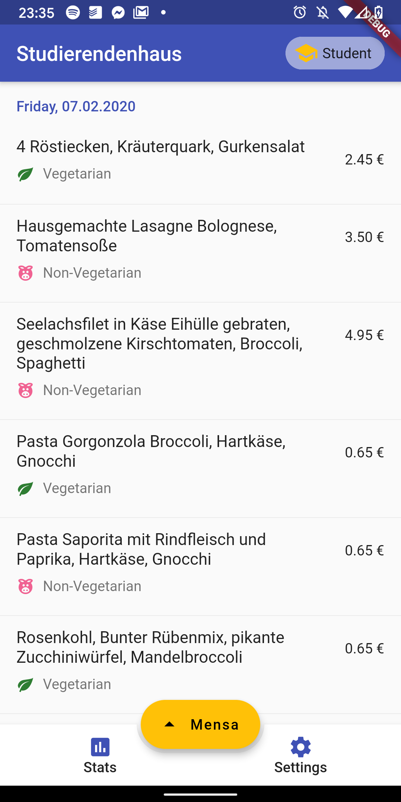

## Mensa Viewer (Flutter)

MensaViewer (Flutter Edition) is a Flutter app inspired 
by fredericobormann's original 
[MensaViewer](https://github.com/fredericobormann/MensaViewer), compatible with 
Android, iOS and soon the web.  
It is built on the newest stuff around Flutter and Dart and features some
cool additions over the original, including:

- [ ] Cross-platform availability
- [X] An overhauled design
- [X] Easy navigation between more than three Mensas at a time
- [X] Indicator whether regular or staff prices are displayed
- [ ] Offline Caching
- [X] All the latest Flutter-Goodness :P

_Note: Some of the above named features are WIP and marked with an unchecked 
box._

---

### Contributing

Any contributions are welcome - feel free to open an issue or pull 
request!

Make sure, however, to give a short description of what feature or bug you have
been working on and document your code.  
Please do also keep in mind that your code needs to be able to run on a variety
of different platforms ;-)

---

### Screenshots

	
	

